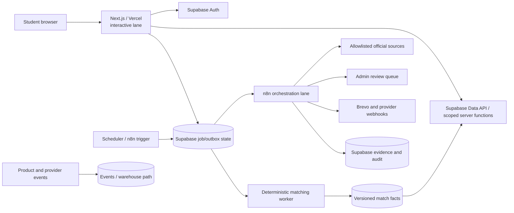
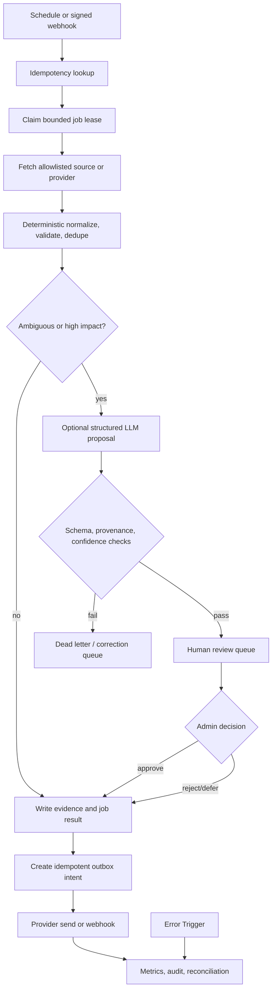

# Scholars Architecture Review and n8n Operating Model

**Review status:** Read-only architecture review; no code, schema, deployment, or production data was changed.  
**Repository reviewed:** `/home/ubuntu/scholars-review-repo`  
**Decision horizon:** From the current activation experiment through a possible 1,000,000 registered users.

## Executive conclusion

Scholars is a viable small-system product, but its current architecture is a synchronous Next.js/Vercel application with Supabase as the primary data store, not yet a queue-backed or agentic platform. The safest evolution is deliberately conservative:

1. Keep **Next.js/Vercel** responsible for authentication, interactive reads and writes, validation, and fast enqueue requests.
2. Keep **Supabase/Postgres** as the system of record for profiles, scholarships, rules, applications, saves, cycle history, consent, job state, evidence, and audit records.
3. Keep **matching, deadline calculation, deduplication, notification policy, and publication state deterministic**.
4. Use **n8n as an orchestration and integration layer** for source polling, bounded fetches, review queues, retries, provider calls, and webhook intake. n8n must not become the matching database, public publishing path, or source of truth.
5. Use AI only where unstructured text creates a measurable benefit: bounded extraction, duplicate-candidate suggestions, evidence summarization, and editable application drafts. AI must not invent deadlines, decide eligibility, verify legitimacy, or publish a listing.
6. Prioritize the existing roadmap: **first value and the re-engagement experiment before broad automation**. The first product question is whether a newly completed profile reaches a useful, explainable match and clicks through to a provider. Automation should improve trust and operating leverage after this path is measurable.

The current platform has good foundations: Supabase Row Level Security (RLS), server-side authentication checks, input validation, cache invalidation on profile writes, CRON_SECRET validation, existing email templates, and an activation/retention event vocabulary. The dominant near-term risks are operational. The scheduled route combines three independent email workloads; it reads broad tables, sends sequentially, and has no durable claim or lease. The matching path evaluates the entire active catalogue and all rules on a cold cache miss. Analytics is fire-and-forget. The repository also contains schema drift indicators, including a scheduled email query that selects `profiles.email` even though the reviewed migration history stores email in `auth.users` rather than in `profiles`.

At higher volume, repeating those patterns would create duplicate email, stale matches, database contention, provider throttling, silent analytics loss, and a large human-review backlog. The remedy is not six autonomous AI agents. The remedy is a small number of reliable operational cores: **evidence-first ingestion and review, deterministic matching, and an idempotent notification outbox**.

## 1. Review boundary and assumptions

This report is based on a static repository review and the supplied audit memos. No live Supabase configuration, production row count, query plan, Vercel configuration, delivery metric, traffic export, vendor invoice, or production log was available. Capacity and cost figures are therefore planning bands, not commitments.

The following assumptions are explicit and should be replaced with measured values before a 100,000- or 1,000,000-user commitment:

| ID | Assumption | Why it matters | How to replace it |
|---|---|---|---|
| A1 | A “user” means a registered profile, not a monthly active user. | Registered-user count overstates or understates matching and email load depending on activation. | Track monthly active profiles, weekly active profiles, and notification-eligible profiles separately. |
| A2 | A representative active user has roughly 20 sessions per month, two match reads, one profile mutation, one saved opportunity, and one weekly digest. | This provides a first-order workload model only. | Measure request mix and cohort behavior from production telemetry. |
| A3 | The catalogue grows from roughly 1,000 active opportunities at the 1,000-user stage toward 100,000 records at the largest stage. | Matching cost is driven by users × active opportunities × rules, not users alone. | Measure verified active rows, rule density, and candidate selectivity. |
| A4 | Source polling is daily or weekly for a bounded allowlist of official sources. | Crawl volume and review load depend more on source count and change rate than on users. | Record source fetches, changed hashes, extraction attempts, and review outcomes. |
| A5 | AI is used only for new or changed source extraction, duplicate review, evidence summarization, and occasional application drafts. | Unbounded model fan-out would dominate cost and introduce an avoidable safety risk. | Enforce per-workflow token budgets and report cost per accepted record. |
| A6 | Email remains the first outbound channel. | Email is already implemented through Brevo, while other channels require separate consent and delivery controls. | Add WhatsApp or other channels only after channel-specific consent, suppression, and receipt handling exist. |
| A7 | The product remains Nigerian-undergraduate focused in the near term. | Existing profile fields and matching semantics are designed around this population. | Version profile and eligibility contracts before adding new populations. |

**Confidence rule.** Repository facts below are labelled as facts. Recommendations about breakpoints, cost, and future service boundaries are inferences from the reviewed design and these assumptions. They require load, failure, and recovery tests before being treated as commitments.

## 2. Product priority: first value before broad automation

The existing roadmap should govern architecture sequencing. Scholars does not first need a large automation graph. It needs evidence that a newly completed profile receives a useful next action.

The primary activation funnel should be explicit:

```text
signed_up
   |
   v
profile_completed
   |
   v
provisional_matches_viewed
   |
   v
match_viewed
   |\
   | \\__ scholarship_saved
   v
provider_clicked
   |
   v
application_started
```

The first experiment should be small and operationally safe. At profile completion, compare the current next step with a direct “Your top three matches” experience. Each result should display the provider, deadline or an explicit unknown state, verification badge, last verified date, source/application path, a short deterministic explanation, a “why this may not qualify” caveat, and a Report issue action. The experiment should optimize for `profile_completed -> provider_clicked` or `profile_completed -> scholarship_saved`, while monitoring issue reports and support complaints.

A directional exit rule is preferable to premature statistical certainty: seek at least a 20% relative lift in the primary activation rate, no material increase in issue reports, event completeness above 95%, and at least 95% of displayed Verified records passing the trust checklist in a weekly sample. These are proposed operating gates, not claims about significance. If the experiment is inconclusive, keep the simpler flow and do not add an AI agent.

This priority changes the architecture in an important way. The first automation should help administrators keep a small trusted catalogue current, not crawl the internet at scale. The first matching workflow should compute explainable results after a profile or catalogue revision, not run on every page load. The first engagement workflow should support a measured re-engagement experiment, not send broad campaigns.

## 3. Current architecture review

### 3.1 Current topology

The repository contains a Next.js 14 application deployed to Vercel. Supabase provides Auth, Postgres, RLS, and the Data API. Brevo provides transactional email. Upstash Redis provides rate limiting and an optional match cache. Gemini configuration exists for draft generation. The inspected `package.json` does not contain n8n, BullMQ, a worker runtime, or a queue client.

`vercel.json` defines one scheduled route, `/api/cron/deadline-check`, at `0 8 * * *`. The route has `maxDuration = 300` and combines deadline reminders, profile nudges, and new-listing digests. The route authenticates with `Bearer CRON_SECRET`, loads broad sets of saved scholarships, notifications, and profiles, then sends email sequentially.

The target topology should separate four lanes:



The lanes have different reliability requirements. Interactive requests should be short and user-scoped. Matching should be deterministic and versioned. Automation should be retryable and bounded. Evidence should preserve the source, retrieval time, extracted claim, confidence, reviewer decision, and version history.

### 3.2 Strengths to preserve

The repository already contains user-facing discovery, saves, applications, provider-click tracking, profile completion, deadline reminders, profile nudges, digests, admin scholarship CRUD, reports, and activation/retention events. The research brief has a strong trust contract: unknown facts remain unknown; official sources are preferred; current-cycle evidence is required for Verified status; material claims need source URLs; and requirements that cannot be represented by the profile must remain visible as caveats rather than being invented as rules.

The matching engine makes a useful distinction between hard gates—discipline, nationality, gender, state or LGA of origin, age, and institution type—and scored fields such as GPA, year of study, JAMB, WAEC credits, financial need, and disability status. That contract should remain code-owned. It is more explainable than an opaque model score, and it correctly preserves `missing_data` and `unverifiable` states.

Supabase RLS and server-side auth checks are valuable boundaries. Supabase documents that exposed tables need both grants and policies, that policy filter columns should be indexed, and that service-role or secret keys bypass RLS and must remain server-side.[1] The n8n credential model must respect the same boundary.

### 3.3 P0 reliability findings

**Recipient identity is a release blocker.** The reviewed scheduled route and digest code select `profiles.email`. The reviewed migration history does not define that column; Supabase Auth stores the email in `auth.users`. Unless live schema contains an undocumented addition, the queries can fail or suppress delivery. Resolve recipient identity through a server-only, narrowly scoped path, or maintain a deliberately synchronized private contact projection. Add an integration test against a fresh migration database and the live-schema contract.

**The scheduled route is too broad and sequential.** Deadline reminders, profile nudges, and listing digests have independent inputs, cadence, and failure semantics. They should be separate job kinds. Vercel documents that cron jobs share Function duration limits, are not retried after failure, may overlap, may duplicate delivery, and require locking plus idempotent reconciliation.[2] A single five-minute invocation is therefore a scheduler, worker, and reconciliation mechanism at once. It is not a durable job system.

**The current reminder dedupe is not atomic.** The route reads existing notification rows, sends email, then inserts a marker. Two concurrent runs can both observe no marker and send. A provider timeout can also leave uncertain side effects. Use a unique delivery key, atomically claim an outbox row, and distinguish provider accepted from delivered.

**The matching cold path scales with the catalogue.** `getMatches.ts` reads every verified undergraduate or both-level scholarship and all scholarship rules, evaluates them in JavaScript, sorts the full result, then loads cycle events for all returned IDs. The cache has a ten-minute TTL and fails open. This is acceptable for a small catalogue and a small active cohort, but an inference from the algorithm is that cold-cache work grows approximately with catalogue rows plus rules and then with cache churn. At 100,000 or 1,000,000 profiles, precomputed or incrementally materialized match facts become necessary.

**Rules need schema validation.** The engine treats unsupported fields as unverifiable, but the database does not appear to constrain fields, operators, or JSON values to the engine’s supported contract. A rule can therefore look configured while not being deterministically evaluable. Add a validation layer and quarantine malformed rules.

**Competitiveness is a heuristic, not a probability.** The engine uses awards, estimated applicants, tier, and historical acceptance rate with nullable values and a floor factor. Without provenance, confidence, and freshness, the resulting score must not be presented as a chance of winning. Call it an eligibility/ranking heuristic and expose its limits.

**Analytics is telemetry, not a ledger.** Browser events are fire-and-forget, and `/api/events` writes one row synchronously. There is no client batch, retry ledger, delivery metric, or demonstrated retention/partition plan. Keep application state and outcomes in transactional tables. Treat high-volume page views as lossy telemetry and consider a separate analytics product or warehouse path.

**Rate limiting has asymmetric failure modes.** `lib/ratelimit.ts` fails closed with HTTP 503 in production when Upstash is absent or unreachable. This protects abuse-sensitive routes but can make a shared Redis incident look like product downtime. Meanwhile, the memos identify expensive or mutating routes without consistent rate checks. Use route-specific limits, payload caps, and an explicit availability policy: fail closed for security-sensitive mutations; consider carefully bounded degradation for non-sensitive reads.

**Admin MFA is not enabled by default.** `REQUIRE_ADMIN_MFA` defaults to false in `.env.example`. Make MFA a deployment gate after every admin has enrolled and verified a factor.

**Migration history is ambiguous.** Duplicate numeric prefixes and superseded/reference-only files increase fresh-environment drift risk. Establish a unique, immutable migration ledger and make fresh database replay a CI gate. Do not assume the `0001` file represents live schema.

**Dependency and verification work remains.** The audit reported critical and high dependency findings in the locked tree and could not run lint because dependencies were absent. This is a verification limitation, not proof of source failure. Patch after compatibility testing, then run reproducible install, lint, typecheck, build, migration replay, RLS tests, and route integration tests.

## 4. Proposed operating model: n8n as orchestrator, not authority

The smallest credible n8n architecture is:



Every workflow should carry `job_id`, `correlation_id`, `schema_version`, `attempt`, and `source_or_event_id`. It should write durable state before an external side effect and make the side effect safe to repeat. n8n execution history is useful for operations but must not be the authoritative job ledger. n8n’s error workflow model can receive workflow name, execution ID, retry relationship, last node, and error details, which supports a shared alerting and dead-letter workflow.[3]

### 4.1 Common job and outbox contract

Start with one additive job table or Supabase Queues. Supabase Queues is a Postgres-native queue with durable messages, visibility-window processing, archival, and RLS/API authorization options.[4] It is a reasonable intermediate step because it keeps the operational ledger near the system of record. A minimal table is:

```sql
workflow_jobs (
  id uuid primary key,
  kind text not null,
  idempotency_key text not null unique,
  payload jsonb not null,
  status text not null, -- pending, leased, succeeded, retryable, dead_letter
  attempts integer not null default 0,
  available_at timestamptz not null,
  lease_until timestamptz,
  correlation_id uuid not null,
  last_error jsonb,
  result_metadata jsonb,
  created_at timestamptz not null,
  completed_at timestamptz
)
```

Use an atomic claim (`FOR UPDATE SKIP LOCKED` or queue visibility semantics), a finite lease, exponential backoff with jitter, and a dead-letter state. A retryable failure includes network timeouts, 429 responses, and selected 5xx responses. Validation, authorization, malformed source content, and permanently invalid recipients should not be blindly retried.

For outbound email, use a separate `notification_deliveries` or `notification_outbox` contract:

```sql
notification_deliveries (
  id uuid primary key,
  profile_id uuid not null,
  scholarship_id uuid,
  campaign_key text not null,
  channel text not null,
  schedule_bucket text not null,
  dedupe_key text not null unique,
  template_version text not null,
  status text not null, -- pending, accepted, delivered, bounced, suppressed, failed
  attempts integer not null default 0,
  provider_message_id text,
  available_at timestamptz not null,
  last_error jsonb,
  sent_at timestamptz,
  created_at timestamptz not null
)
```

The unique `dedupe_key` should include the user, opportunity or campaign, channel, and schedule bucket. A timeout after a provider request must be reconciled through provider message IDs or a provider-supported idempotency mechanism before resending. “Accepted by Brevo” and “delivered to the mailbox” are different states.

### 4.2 Workflow 1 — Discovery and ingestion

**Purpose.** Find new or changed opportunities without trusting promotional text or creating public records automatically.

**Trigger.** A daily n8n Schedule Trigger for a small allowlist of official URLs, RSS feeds, or documented APIs; a signed admin webhook for urgent sources.

**Flow.** Select active sources due for polling. Fetch with connect/read timeout, content-type checks, response-size caps, limited redirects, and an SSRF-safe domain/IP policy. Canonicalize URL, provider, title, deadline, and cycle. Store a content hash and raw snapshot pointer. If unchanged, update `last_checked_at` and stop. If changed, deterministically extract obvious fields and send only ambiguous text to a schema-constrained model. Store proposed claims with exact evidence spans and source URLs. Deduplicate by canonical URL plus provider/title/deadline fingerprint. Create a Pending review item for missing application path, conflicting dates, low evidence completeness, suspicious domains, or unsupported requirements.

**Tables.** `scholarship_sources`, `scholarship_candidates`, `scholarship_evidence`, `verification_cases`, `workflow_jobs`, and, only after approval, `scholarships`, `scholarship_rules`, and `cycle_events`.

**n8n nodes.** Schedule Trigger, signed Webhook, HTTP Request, Code, HTML/RSS parser, Postgres or Supabase, IF/Switch, Split in Batches, optional LLM, Execute Sub-workflow, Stop and Error, and Error Trigger.

**Failure policy.** Retry 429/5xx/network errors up to three times with jitter and `Retry-After`. Do not retry invalid HTML, unauthorized sources, or schema validation failures. Preserve the last approved record when a source disappears; mark it stale or pending instead of deleting it.

**AI boundary.** AI may propose normalized fields and evidence summaries. It may not mark Verified, select a final deadline, broaden a course list, or prove legitimacy.

### 4.3 Workflow 2 — Verification and recheck

**Purpose.** Separate “the programme exists” from “the current cycle and application path are confirmed.”

**Trigger.** New candidate, material source hash change, scheduled freshness check, student report, or admin action.

**Flow.** Re-fetch the primary source. Check HTTPS, provider identity, current application path, student deadline, award coverage, and explicit eligibility statements. Compare against the prior evidence version and detect contradictions. Apply deterministic risk signals. Route uncertainty to a human review queue. Only an admin decision can promote or retain Verified.

The research brief defines the Verified standard: the programme must be attributable to the named provider; the current application path must be confirmed; the deadline must be tied to the student window; material requirements must be checked; a student-visible path must exist; and dated research notes must record sources, confidence, and unresolved issues. A programme can be real while its current cycle is unconfirmed; it should remain Pending review in that case.

### 4.4 Workflow 3 — Eligibility and matching

**Purpose.** Recompute explainable match facts after a profile, scholarship, or rule version changes. Do not compute the full catalogue on every page load at scale.

**Trigger.** Profile revision, scholarship revision, rule revision, or nightly repair batch for missed events.

**Flow.** Create a versioned `match_recompute` job with `profile_revision`, `catalog_revision`, `rules_version`, and `input_hash`. Prefilter active Verified records and hard gates in SQL where practical. Evaluate the remaining rules with the existing deterministic engine. Persist `eligible`, `ineligible`, or `unknown` states; score supported non-gating fields; and generate templated explanations from the evaluated requirements. Upsert idempotently. Emit a new-match transition only when the stored state changes materially.

**AI boundary.** No AI is required. If an explanation is later paraphrased by AI, the model must receive only the already-evaluated facts and must not change the decision.

**Scale transition.** At 1,000 users, event-driven recalculation plus a nightly repair pass may be sufficient. At 10,000, materialized candidate sets and indexed match facts become useful. At 100,000 and above, partition recomputation by profile and scholarship revisions and serve ranked pages from indexed results. At no stage should n8n evaluate one item per student-scholarship pair.

### 4.5 Workflow 4 — Deadline reconciliation and notification

**Purpose.** Send useful reminders exactly once per configured bucket while recovering from missed schedules and avoiding notification fatigue.

**Trigger.** Daily reconciliation at MVP; more frequent schedule or queue consumer when timing requirements justify it; immediate recheck after a material source change.

**Flow.** Select verified opportunities with a student deadline in configured buckets, such as 14, 7, 3, 1, and 0 days. Apply consent, quiet hours, channel preference, suppression, and per-user caps. Insert unique pending delivery intents. A bounded dispatcher claims intents and calls Brevo. Record provider response and message ID. Reconcile webhook states for delivered, bounce, complaint, and unsubscribe. A late run sends the next valid bucket rather than replaying every missed email.

Brevo documents rate limits, returns 429 when limits are exceeded, and provides rate-limit headers. It also supports up to 1,000 personalized transactional message versions in one batch request.[5] [6] The dispatcher should therefore batch compatible sends, distribute requests evenly, honor `Retry-After`, and use provider feedback to suppress future sends.

**AI boundary.** No AI is required for date arithmetic, consent, caps, dedupe, or sending.

### 4.6 Workflow 5 — Profile completion

**Purpose.** Improve match coverage without nagging students about fields that do not affect current opportunities.

**Trigger.** Profile update event plus a low-frequency weekly digest for active incomplete users.

**Flow.** Compare missing fields with currently active rules. Rank missing fields by the number of matches they would unblock or materially improve, while considering sensitivity. Create or update a deduped nudge. Send at most one digest in a cooling window. Stop after completion, dismissal, or opt-out.

This should be deterministic. The message should say what field is missing, why it matters, and what the student can do. Do not use AI to infer or “correct” sensitive profile values.

### 4.7 Workflow 6 — Engagement and re-engagement experiment

**Purpose.** Improve return visits and provider clicks while preserving the first-value experiment and avoiding notification fatigue.

**Trigger.** Weekly cohort schedule, meaningful new-match transition, saved-opportunity deadline, and inactivity threshold.

**Flow.** Select users in an experiment arm. Rank recent match transitions, saved opportunities, and deadline urgency deterministically. Suppress users recently contacted, opted out, bounced, complained, or lacking meaningful new content. Coalesce into one digest. Create outbox rows, send through Brevo, and record open, click, save, application-started, unsubscribe, bounce, and complaint events. Reduce cadence after repeated non-engagement.

The experiment should remain in the product layer. n8n can orchestrate selection and delivery, but it should not decide the experiment assignment or alter the primary metric definition. AI-generated copy is not a prerequisite and should be deferred until it demonstrates lift without increasing complaint or issue rates.

## 5. Recommended schema additions

The existing tables—profiles, scholarships, scholarship rules, saved scholarships, notifications, applications, cycle events, reports, and events—should remain canonical. Additive tables are preferred over a broad rewrite, subject to live-schema reconciliation.

| Table or view | Purpose | Key fields and constraints |
|---|---|---|
| `scholarship_sources` | Registry of approved source endpoints. | Provider/domain, URL, source type, active, cadence, last checked, freshness SLA. Unique canonical URL. |
| `scholarship_candidates` | Staging area for unapproved records. | Source ID, canonical URL, content hash, raw snapshot reference, status, first/last seen. Never directly public. |
| `scholarship_evidence` | Claim-level provenance. | Source URL, claim type, quoted excerpt or object pointer, checked time, extractor version, confidence, reviewer. |
| `scholarship_versions` | Immutable field and rule changes. | Scholarship ID, revision, diff, source evidence IDs, effective time, author or workflow. |
| `verification_cases` | Human review queue. | Candidate/scholarship ID, reason, priority, status, assignee, due time, decision, decision notes. |
| `match_snapshots` or `match_scores` | Versioned deterministic match facts. | Profile ID, scholarship ID, profile revision, catalogue revision, rules version, input hash, status, score, reasons, computed time. Unique input tuple. |
| `workflow_jobs` and `job_attempts` | Durable orchestration state. | Kind, idempotency key, payload, lease, retry data, correlation ID, result, dead-letter state. |
| `notification_deliveries` | Outbox and provider reconciliation. | User, opportunity/campaign, channel, schedule bucket, dedupe key, template version, status, provider ID, attempts. Unique dedupe key. |
| `profile_nudges` | Nudge policy and cooling state. | Profile, field, reason, impact estimate, dismissed time, last sent, next eligible time. |
| `provider_events` | Inbound Brevo or other provider ledger. | Provider event ID, type, received time, payload hash, processed time. Unique provider event ID. |
| `workflow_runs` | Cross-system operational summary. | Workflow name, n8n execution ID, correlation ID, status, counts, duration, error class. |
| `consents` and `notification_suppressions` | Purpose/channel-level consent and suppression. | Purpose, channel, granted/withdrawn times, source, policy version, unsubscribe, bounce, complaint. |
| `audit_log` | High-impact administrative trail. | Actor, action, target, before/after hashes, reason, timestamp, trace ID. |

Index actual filters and orderings: `status, available_at`, canonical URL and content hash, source and freshness, profile ID, scholarship ID, deadline/open state, dedupe key, provider event ID, and RLS policy columns. Partition or roll up high-volume events, provider events, and audit data by time when query plans justify it. Store raw HTML and large documents in controlled object storage, not in n8n execution blobs or oversized Postgres rows.

## 6. Queue, retry, and hosting model

### 6.1 Scale stages

| Scale | Recommended execution model | What changes | What remains invariant |
|---:|---|---|---|
| 10–100 users | One managed n8n instance or manual admin operation; daily schedules; small Supabase job/outbox table. | Add idempotency, cron lock, email identity fix, and review queue. | Supabase source of truth, deterministic matching, human publication. |
| 1,000 users | Bounded batches; pooled serverless database access; nightly repair; optional Supabase Queues. | Add indexes, catalog/profile revisions, incremental match jobs, and batch email. | Rule semantics, evidence contract, RLS, delivery dedupe. |
| 10,000 users | Durable queue; separate ingestion, matching, and notification consumers; n8n queue mode or managed equivalent if measured. | Prune execution data, cap concurrency, add object storage and dashboards. | n8n remains orchestration; canonical state remains in Supabase. |
| 100,000 users | Dedicated workers by workload; precomputed candidate sets; partitioned event/outbox tables; read model or read replica as measured. | Stop full N×M matching and large per-user fan-out. | Deterministic eligibility and evidence/audit model. |
| 1,000,000 users | Independently scalable ingestion, matching, delivery, and analytics services; managed durable queue; partitioned data planes; formal SLOs. | n8n becomes primarily control-plane and admin automation. Load, chaos, recovery, and provider-quota tests are mandatory. | User-visible trust contract, RLS principles, versioned rule evaluation, idempotency. |

n8n queue mode uses a main instance for triggers, Redis as the broker, Postgres-backed execution state, and worker processes. n8n states that queue mode provides its best scalability; it also requires a shared encryption key across main and workers and does not support filesystem binary storage in queue mode, so external object storage is required for binaries.[7] This is a later-stage operating choice, not an MVP default.

Supabase’s serverless connection guidance recommends the shared transaction pooler for serverless callers and warns that application-side pools can exhaust database capacity across warm instances.[8] Use small pool sizes, module-scoped clients where appropriate, and query plans before increasing concurrency.

### 6.2 Shared failure rules

A job may be delivered more than once. Therefore:

- Deduplicate at enqueue time.
- Claim with an atomic lease or queue visibility timeout.
- Make every database write idempotent with a unique key or input revision.
- Retry only transient failures and respect provider retry headers.
- Cap attempts and move poison jobs to a visible dead-letter state.
- Alert on oldest job age, queue depth, lease expiry, and retry volume, not just error count.
- Keep successful partial work. Replay only pending work.
- Preserve the last approved scholarship version if a recheck fails.
- Never mark an email delivered merely because the request was attempted.

## 7. Monitoring and operational controls

### 7.1 Minimum operational dashboard

| Area | Metrics | Alert examples |
|---|---|---|
| Interactive product | p50/p95 latency, 4xx/5xx, auth failures, rate-limit responses, match read duration. | p95 above SLO for 15 minutes; error budget burn; auth/RLS anomaly. |
| Cron and schedules | Invocation count, missed-run watermark, duplicate run count, duration, near-timeout count. | No successful reconciliation in one interval; duration above 80% of limit. |
| Jobs and queues | Depth by kind, oldest age, attempts, dead letters, lease expirations, throughput. | Oldest job over SLA; dead-letter spike; consumer lag. |
| Source quality | Source freshness, changed hashes, fetch status, broken links, contradiction rate, review backlog. | Critical source stale; review SLA breach; sudden extraction drift. |
| Matching | Candidate count, match coverage, unknown/missing-data rate, rules-version drift, recompute duration, stale match count. | Coverage drops; version mismatch; p95 recompute exceeds budget. |
| Notifications | Eligible, suppressed, dedupe hits, accepted, delivered, bounce, complaint, unsubscribe, provider latency. | Bounce/complaint threshold; duplicate suppression anomaly; provider 429 surge. |
| AI | Requests, input/output tokens, 429s, validation failures, cost estimate, human correction rate. | Budget burn; schema-failure spike; ungrounded-claim review rate. |
| Database | Connections, CPU, locks, slow queries, storage, table growth, pooler saturation. | Connection exhaustion; sequential scan on hot path; lock waits. |
| Security | Admin MFA status, service-role use, webhook failures, RLS test results, suspicious source requests. | Any unexpected privileged write; signature replay; SSRF-policy violation. |

Attach `trace_id` and `job_id` to Vercel logs, Supabase records, n8n execution summaries, Brevo requests, and provider webhooks. General logs must redact full email addresses, tokens, profile fields, source bodies, and model prompts. Retain detailed evidence where the product needs auditability, but apply purpose-based retention to PII and raw content.

### 7.2 Error workflow

Use one n8n Error Trigger workflow for all production workflows. It should capture workflow name, execution ID, retry relationship, last node, error class, `job_id`, and correlation ID; write a short `workflow_runs` summary; alert the owner; and leave a replayable dead-letter job. n8n documents both execution inspection and error workflows that begin with Error Trigger.[3]

Do not rely on n8n execution history as a permanent audit store. Configure execution pruning and save minimal successful execution data. Keep the application’s job, evidence, notification, and audit records in Supabase or controlled object storage.

## 8. Security and privacy model

### 8.1 Access boundaries

The browser uses publishable Supabase access only through RLS-protected tables and scoped routes. Service-role or secret keys stay in Vercel server environment variables, worker secrets, or n8n credential storage. Supabase states that secret and service-role keys bypass RLS and are never safe to expose to customers.[1] [9]

Every new exposed table requires grants, RLS policies, policy-column indexes, and negative tests for cross-user reads and writes. Worker access should use the narrowest possible service role or a dedicated database role. Replace user-triggered service-role calls with scoped RPCs or server routes where possible.

Administrative actions require verified MFA, especially publication, rule changes, source allowlist changes, and mass notification. Signed cron requests and webhook requests need replay protection, payload limits, schema validation, and constant-time secret or HMAC comparison.

### 8.2 Source fetching and prompt isolation

Fetching a source URL is an SSRF boundary. Enforce allowlisted domains, HTTPS, redirect limits, DNS/IP checks, content-type and body-size limits, timeouts, HTML sanitization, and no arbitrary file downloads. Treat provider pages, imported documents, and user free text as untrusted data, not instructions.

A model prompt should delimit source content and provide an explicit instruction hierarchy. Require JSON-schema output with field-level provenance. Reject extra claims, unsupported values, and output that lacks source spans. Store model name, model version, prompt-template version, input hash, latency, token estimate, and reviewer outcome without retaining unnecessary sensitive profile data.

Gemini quotas are measured per project across requests per minute, input tokens per minute, and requests per day.[10] Queue AI calls, cap concurrency and monthly spend, cache by source hash and prompt/model version, and use the least capable model that passes the evaluation set. Batch or defer non-urgent extraction.

### 8.3 Consent and data lifecycle

A saved scholarship is not unlimited notification consent. Model consent by purpose and channel with grant and withdrawal timestamps, source, policy version, quiet hours, frequency caps, unsubscribe, bounce, complaint, and suppression state. Maintain these controls in Scholars even when Brevo also stores suppression state.

The repository’s deletion behavior intentionally leaves `auth.users` email state. Before expansion, define export, deletion, retention, legal-basis, and full-erasure states. Partition or archive analytics and provider-event records on a declared schedule.

## 9. Cost model and cost controls

Exact cost cannot be responsibly inferred from the repository because plan tiers, invoice terms, source volume, active profiles, and notification rates are unknown. The following bands are planning ranges that exclude founder labour, human review, legal/compliance, support, taxes, and enterprise contracts.

| Registered users | Main bottleneck | Directional monthly automation band* |
|---:|---|---:|
| 10 | Correctness, manual review, duplicate sends. | Under $50 in a minimal setup. |
| 100 | Provider calls, stale reminders, source exceptions. | Tens to low hundreds of USD. |
| 1,000 | Database scans, connection bursts, daily fan-out, model quotas. | Roughly $100–$500. |
| 10,000 | Queue throughput, execution history, analytics, email volume. | Roughly $500–$3,000. |
| 100,000 | Matching fan-out, database IO, email/provider quotas, source fetching. | Roughly $3,000–$20,000+. |
| 1,000,000 | Dedicated queues/workers/data planes, deliverability, support and observability. | Tens of thousands to six figures or more; capacity test and vendor quotes required. |

\*Planning bands, not vendor quotes. Workload shape matters more than registered-user count.

Control cost by keeping matching non-LLM; hashing sources before parsing; fetching only when due or changed; batching database writes and Brevo sends; capping model tokens and concurrency; pruning successful n8n execution payloads; archiving raw source documents; and setting budget alerts. Brevo’s batch capability can reduce request overhead, but it does not remove the need for consent, dedupe, and provider reconciliation.[6]

A practical cost model should report:

```text
monthly_cost = platform_baseline
             + active_profiles × match_recompute_rate × database_cost_per_recompute
             + source_fetches × fetch_cost
             + changed_sources × extraction_tokens × model_price
             + outbound_messages × provider_cost
             + queue_and_worker_runtime
             + storage_and_retention
             + observability
```

The most important unit metrics are cost per verified listing, cost per activated profile, cost per provider click, AI cost per accepted record, email cost per engaged user, and human-review minutes per approved listing.

## 10. MVP, V2, and V3

### MVP: first value and trusted operations

The MVP should implement only what protects the activation and re-engagement roadmap:

1. Fix recipient identity resolution and prove scheduled queries against a fresh migration database.
2. Add a small idempotent job/outbox contract, unique notification dedupe, a lease, retry state, and dead letters.
3. Split the combined scheduled route conceptually into deadline reconciliation, profile nudges, and listing digest job kinds.
4. Run one allowlisted daily discovery workflow that creates Pending review candidates and evidence; do not auto-publish.
5. Keep matching deterministic and server-side. Add profile/catalog revision invalidation and a nightly repair pass.
6. Expose the first-value experiment and the funnel from profile completion to provider click or save.
7. Provide one admin trust queue for missing evidence, stale or conflicting deadlines, broken links, and student reports.
8. Send one bounded weekly engagement digest with consent, caps, suppression, and provider status.
9. Enable admin MFA, apply route-specific rate limits and payload caps, and add alerts for cron, queue, and provider failures.

**MVP exit criteria:** every workflow is idempotent; retry/replay creates no duplicate rows or emails; a failed fetch leaves the approved record unchanged; an admin can review evidence and approve or reject in one session; event completeness exceeds 95%; and the activation experiment produces a directional decision.

### V2: bounded automation and incremental recomputation

After activation lift and review throughput are demonstrated, add official source adapters, evidence snapshots, scheduled rechecks, source diffs, verification UI, delivery webhooks, incremental `match_scores`, batched analytics, and Supabase Queues or an equivalent durable queue. Add a reusable n8n sub-workflow for fetch, retry, evidence write, and audit. Use queue mode or multiple workers only when measured queue age, execution duration, or provider limits justify it.

V2 should still keep publication human-approved, matching deterministic, and notifications outbox-backed. AI may summarize stored evidence or draft student-facing prose constrained to known claims.

**V2 exit criteria:** at least 90% of candidates resolve within the agreed review SLA; stale-deadline and duplicate rates trend down; replay tests are clean; p95 match latency remains within plan limits; and activation gains persist across two measurement windows.

### V3: independently scalable services

Only after V2 operations are boring should Scholars add dedicated ingestion, matching, delivery, and analytics workers; precomputed active-profile matches; partitioned or archived events; source reliability scoring; read models or search infrastructure; provider quota reservations; and multi-region or disaster-recovery measures as justified by tests.

A bounded research copilot may propose evidence-linked changes, but a human retains publication authority. New channels such as WhatsApp require explicit consent, per-channel budgets, delivery receipts, and an auditable opt-out. Semantic retrieval can support discovery and explanations, but never acts as eligibility authority.

**V3 exit criteria:** no single n8n graph is a correctness-critical write path; queue backlog and review SLA have alert thresholds; source freshness, correction rate, broken-link rate, activation, retention, deliverability, and provider-click outcomes have weekly dashboards; and load, replay, security, and restore tests pass at target scale.

## 11. Deployment and operations checklist

This review does not claim that any checklist item has been completed.

### Before the first production automation change

- [ ] Reconcile the live Supabase schema against migrations; identify reference-only and manually applied scripts.
- [ ] Fix email identity resolution without exposing `auth.users` data to the browser.
- [ ] Add unique constraints and atomic claims for delivery intents and workflow jobs.
- [ ] Choose one scheduler for each job kind and document ownership; do not let Vercel Cron and GitHub Actions run the same work without a lease.
- [ ] Make every cron path lock-protected and reconciliation-based because Vercel does not retry failed invocations and may miss or duplicate delivery.[2]
- [ ] Enable `REQUIRE_ADMIN_MFA=true` only after every administrator has an enrolled and verified factor.
- [ ] Test RLS, grants, service-role boundaries, scoped RPCs, and negative cross-user cases.
- [ ] Add URL/domain, redirect, body-size, content-type, timeout, and SSRF controls before source fetching.
- [ ] Define consent, unsubscribe, bounce, complaint, quiet-hours, and frequency-cap behavior.
- [ ] Rotate and inventory CRON_SECRET, Supabase secrets, Brevo keys, Gemini keys, Redis keys, and alert-webhook credentials.
- [ ] Add correlation IDs, job IDs, workflow-run records, alert thresholds, and dead-letter replay procedure.

### Before V2 queue or n8n expansion

- [ ] Run migration replay from a clean database and schema-drift checks in CI.
- [ ] Run lint, typecheck, build, route integration tests, RLS tests, and provider webhook tests from a reproducible install.
- [ ] Test duplicate cron delivery, overlapping workers, provider timeout after acceptance, 429 with `Retry-After`, malformed source content, source disappearance, and replay.
- [ ] Configure n8n credentials with least privilege, shared encryption key if queue mode is used, health/readiness monitoring, and execution pruning.
- [ ] Store raw source documents outside n8n execution blobs; use external object storage for queue-mode binaries.[7]
- [ ] Add model schema validation, prompt/version ledger, source hash caching, token budgets, and human correction sampling.
- [ ] Configure Brevo webhooks, provider message IDs, suppression synchronization, and batch-send limits.[5] [6]
- [ ] Load-test matching, notification selection, source fetches, and review queue operations with representative catalogue sizes.
- [ ] Back up the database and rehearse restore, rollback, and dead-letter replay.

### Before 100,000+ users

- [ ] Prove pooler configuration and connection headroom under serverless and worker concurrency.[8]
- [ ] Replace full-catalog reads with indexed candidate filtering and incremental match materialization.
- [ ] Partition or roll up events, provider events, and audit data by retention period.
- [ ] Isolate ingestion, matching, notifications, and analytics worker pools.
- [ ] Define SLOs for match freshness, reminder lateness, source freshness, review SLA, deliverability, and job age.
- [ ] Obtain provider capacity and pricing commitments; reserve quotas where necessary.
- [ ] Run failure-injection, security, recovery, and cost-budget tests at the target scale.

## 12. Self-critique and premise challenge

The five memos converge on a premise worth challenging: naming six components does not imply that six components should be AI agents. AI is not justified for dates, URL checks, rule evaluation, deduplication, deadline buckets, missing-field detection, consent, ranking, sending, or legitimacy decisions. Those tasks have explicit inputs, deterministic correctness conditions, and high costs when wrong.

The current AI draft path also demonstrates the risk. Profile and scholarship text are interpolated into a prompt and Gemini output is written to an application draft. Without structured output, claim validation, prompt-injection isolation, plagiarism checks, and explicit user approval, the output must remain an editable draft. Provider requirements and stored profile facts remain authoritative.

The architectural recommendation could still be too optimistic in two ways. First, a job table and n8n can add operational complexity earlier than a solo developer can comfortably support. That is why the MVP should use one small bounded queue contract, manual verification, and a small allowlist rather than queue-mode n8n. Second, the proposed scale breakpoints are hypotheses. A catalogue of 100,000 low-rule records may be easier than a catalogue of 1,000 high-rule records with frequent edits and heavy evidence review. Actual query plans, queue age, provider quotas, and review minutes must govern each transition.

The strongest enduring design is therefore not “more agents.” It is a stable contract:

> **Evidence first, deterministic eligibility, explainable state, idempotent side effects, human approval for uncertainty, and measured activation before automation breadth.**

## References

[1]: https://supabase.com/docs/guides/database/postgres/row-level-security "Supabase Row Level Security"

[2]: https://vercel.com/docs/cron-jobs/manage-cron-jobs "Vercel Managing Cron Jobs"

[3]: https://docs.n8n.io/build/flow-logic/handle-errors-gracefully "n8n Handle errors gracefully"

[4]: https://supabase.com/docs/guides/queues "Supabase Queues"

[5]: https://developers.brevo.com/docs/api-limits "Brevo API rate limits"

[6]: https://developers.brevo.com/docs/batch-send-transactional-emails "Brevo Batch send transactional emails"

[7]: https://docs.n8n.io/deploy/host-n8n/configure-n8n/scaling/enable-queue-mode/ "n8n Enable queue mode"

[8]: https://supabase.com/docs/guides/database/connecting-to-postgres#connection-management "Supabase connection management"

[9]: https://supabase.com/docs/guides/database/secure-data "Supabase securing your data"

[10]: https://ai.google.dev/gemini-api/docs/rate-limits "Gemini API rate limits"

[11]: https://vercel.com/docs/functions/limitations "Vercel Functions limitations"

[12]: https://vercel.com/docs/cron-jobs/usage-and-pricing "Vercel Cron usage and pricing"

[13]: https://docs.n8n.io/integrations/builtin/core-nodes/n8n-nodes-base.errortrigger/ "n8n Error Trigger"

[14]: https://developers.brevo.com/docs/secured-webhooks "Brevo secured webhooks"

[15]: https://supabase.com/docs/guides/functions "Supabase Edge Functions"

> **Repository evidence used in this review:** `/home/ubuntu/scholars-review-repo/app/api/cron/deadline-check/route.ts`, `/home/ubuntu/scholars-review-repo/lib/email/digest.ts`, `/home/ubuntu/scholars-review-repo/lib/matching/getMatches.ts`, `/home/ubuntu/scholars-review-repo/lib/matching/engine.ts`, `/home/ubuntu/scholars-review-repo/lib/ratelimit.ts`, `/home/ubuntu/scholars-review-repo/vercel.json`, `/home/ubuntu/scholars-review-repo/package.json`, the reviewed Supabase migrations, and `/home/ubuntu/scholars-review-repo/docs/scholarship-researcher-brief.md`. These are local repository artifacts rather than public references.

> **Caveat:** This report is an architecture recommendation, not a deployment record, performance certification, security certification, or claim that any proposed workflow has been implemented.

